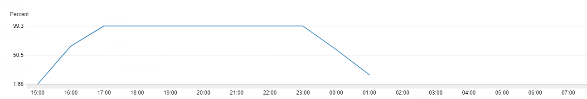

# 🏆 Benchmarks

You may now ask - is it faster than traditional methods that create one browser for each page?

 Benchmarks speak for themselves. Below you will find a benchmark that was made on an app that uses a traditional, new-browser-for-each-request method like [spatie/browsershot](https://github.com/spatie/browsershot) to analyze links, compared to the one used by Clusteer.

 With Browsershot, the CPU usage skyrockets to 99%. AWS forces autoscaling and gets a total of 6 x `m5.large` instances (2 vCPU, 8 GB RAM) to 99%. There were analyzed 100 links every 1 hour. There are only 3 concurrent jobs that process them in parallel. At the end of the benchmark, the analysis was stopped because the CPU usage couldn't get down from 99%.

With Clusteer, the CPU keeps below 40%. More than that, it was set up to analyze 1000 links every 1 hour, with 3 max opened browsers on 3 concurrent jobs that process them in parallel. In this case, there were only 4 x `m5.large` instances (2 vCPU, 8 GB RAM), and they all keep below 40%.

You can see clearly - with the standby servers, it comes fewer CPU usage, more analyzed links and there is still plenty of room to compute more than this since there is still a gap between hours (from :25 to :55 for example)

The advantage here is that there are 3 opened browsers that wait for tasks, so there are no more start-up delays when opening a new browser - only new incognito pages/tabs are created and destroyed after each request.
